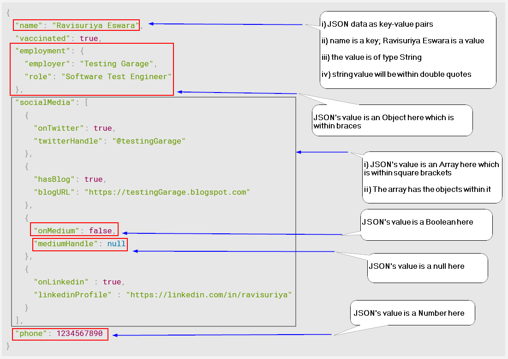

# JSON For Software Test Engineers - 101

## What is JSON?

 - JSON is a string format; it is not an object
	 - It is language independent
		 - This makes it an ideal data-interchange format
	 - It is used for storing and transporting data
 - JSON stands for **J**ava**S**cript **O**bject **N**otation

#### Example:
```json
{
  "name": "Ravisuriya Eswara",
  "vaccinated": true,
  "employment": {
    "employer": "Testing Garage",
    "role": "Software Test Engineer"
  },
  "socialMedia": [
    {
      "onTwitter": true,
      "twitterHandle": "@testingGarage"
    },
    {
      "hasBlog": true,
      "blogURL": "https://testingGarage.blogspot.com"
    },
    {
      "onMedium": false,
      "mediumHandle": null
    },
    {
      "onLinkedin" : true,
      "linkedinProfile" : "https://linkedin.com/in/ravisuriya"
    }
  ],
  "phone": 1234567890
}
```
#### More About JSON
-	JSON format was originally suggested by Douglas Crockford
-	MIME Type of JSON is application/json
-	The JSON file extension is .json


## Why JSON?
### Structures of JSON
- JSON is built on two structures
	1.  **A collection of key-value pairs**
		-	examples of same in different programming language:
			-	record, object, dictionary, keyed list
	2.  **An ordered list of values**
		-  examples of same in different programming language:
			- list, array, vector

These [data] structures are universal.  Most of the programming languages support them in one or other forms.  

Hence it is logical to use the JSON for data interchange as most of the programming languages supports these [data] structures.

## JSON Data and its Data Types

- The entire JSON text which is within curly braces is called **JSON object literals**
	- JSON data is written in key-value pairs
	- Key and Value is separated by a colon
	- Each key-value pair is separated by a comma
	- **Note**:
		- *JSON object literal is different from JSON object*
			- *JSON is a string format and it cannot be an object*
			- JSON object literal contains key-value pairs
- In **JSON**, the values is one of the following **data types**:
	- a string
	- a number
	- an object
		- the JSON value having data within curly braces { }
	- an array
		- the JSON value having data within square brackets [ ]
	- a boolean
	- null
- JSON values **cannot** be one of the following data types:
	- a date
	- a function
	- undefined

## Knowing the JSON String
Using the below image we learn:
- The entire JSON string within curly braces is called JSON object literal
- This JSON object literal contains key-value pairs
- The JSON value can be of  different data type




##  Serialization and Deserialization
### Serialization
	- Converting an object to a string is stringifying
		- It is serialization

- When sending data to a web server, the data has to be a string
- We stringify the object to convert it to a string

-  In other words,
	- Converting an object into a sequence of bytes
		- It takes an in-memory data structure and converts it into a series of bytes
		- This bytes can be stored and transferred

### Deserialization
	- Parsing a JSON string (data) and storing it in a variable, makes it an object
		- It is deserialization

- We receive the data from a web server; the data is always a string
- We parse this data; the parsed data becomes an object which is stored in a variable

-	In other words,
	-	It is opposite of serialization
		-	It takes a series of bytes and converts it to an in-memory data structure that can be consumed programmatically

## References
1. https://w3schools.com
2. https://www.json.org/json-en.html
3. https://www.scaler.com/topics/java/serialization-and-deserialization/
4. https://betterprogramming.pub/serialization-and-deserialization-ba12fc3fbe23
